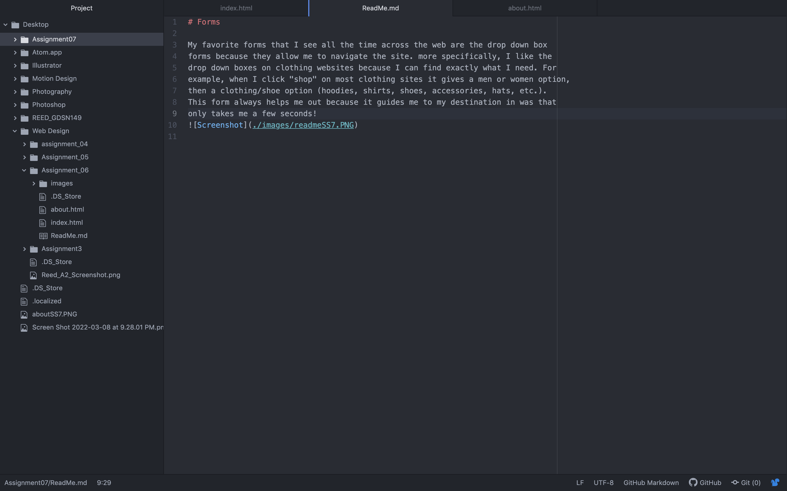

# Forms

My favorite forms that I see all the time across the web are the drop down box
forms because they allow me to navigate the site. more specifically, I like the
drop down boxes on clothing websites because I can find exactly what I need. For
example, when I click "shop" on most clothing sites it gives a men or women option,
then a clothing/shoe option (hoodies, shirts, shoes, accessories, hats, etc.).
This form always helps me out because it guides me to my destination in was that
only takes me a few seconds!

