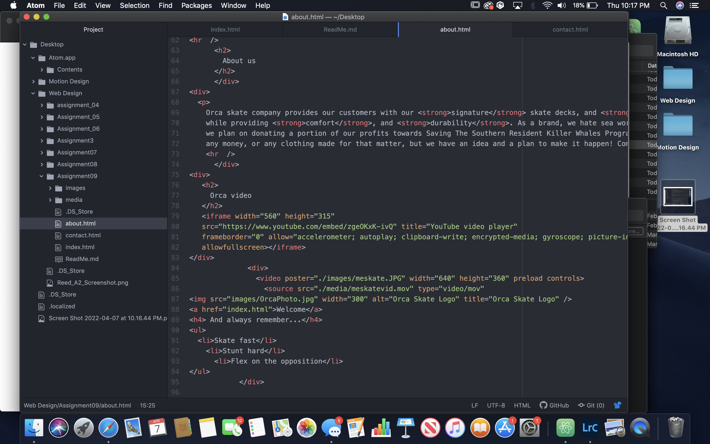
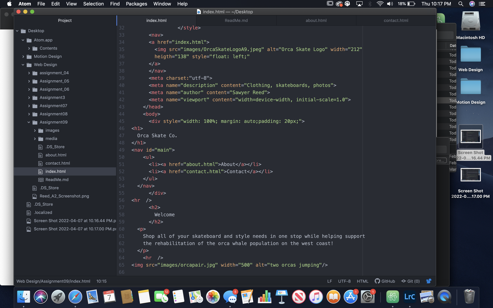
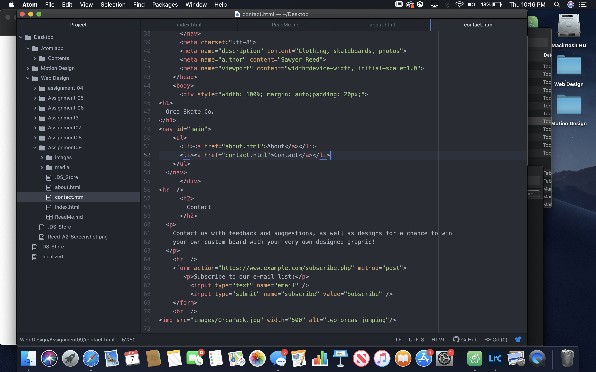

# Briefly recap your experience learning HTML. What was old, new, interesting, or difficult to learn?

After we come back from spring break we will start to dive into CSS and expand on styling, which helps us "decorate" HTML. Is there anything you're anxious or excited to learn about in this new section?

Learning HTML was hard but an interesting process because it was all new to me. Since everything was new, I found everything difficult but now I am starting to get a grasp, and am even able to solve my coding mistakes on my own. I am excited to learn how to style my page because I feel like I have the content and ideas for my website, just not the skills necessary. Hopefully everything comes together well by the end of this class!

