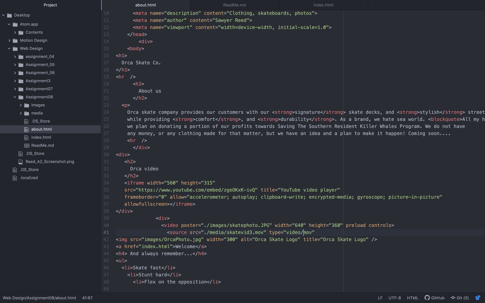

# What is an affordance?
What are the advantages and disadvantages of using a third-party service like YouTube or Vimeo to host your videos?

An affordance is the use that an object (or button) has for the user. For example, a hammer is used to embed and extract nails. One advantage for using a website like YouTube to host videos is it can host large and high quality files while using less bandwidth compared to self hosting. A disadvantage would be that you're more prone to having your the content taken down for copyright purposes.

