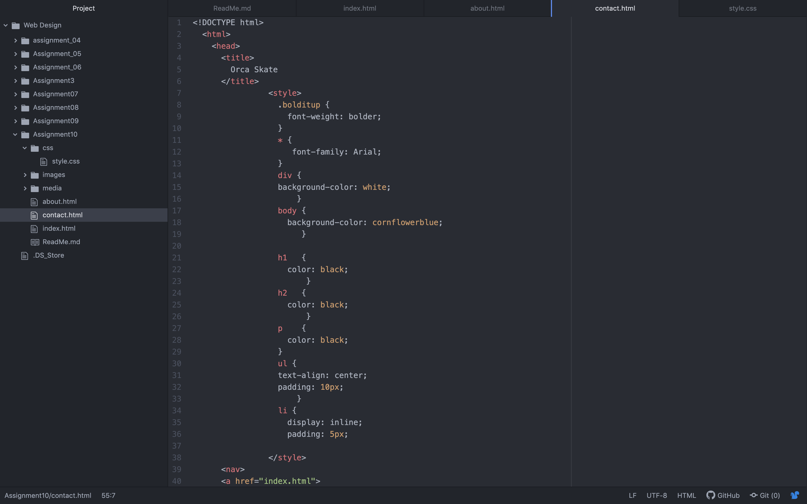

# Describe the difference between the universal, element, class, and id selector types. When might you choose one over the other to style content?

The universal selector styles every element on the page, the element selector is used to select all elements of a certain type, the class selector styles elements based on their class attribute, and the id selector styles elements based on their id attribute. Depending on what you are doing, you can use the universal selector to style every element, or the other more refined forms of selectors to style specific elements. My color palette is based off of orcas and the ocean so it will be mostly black and white values along with blue values as well. I hope to make it look sleek and official and use mainly blacks and whites with blue accents.

