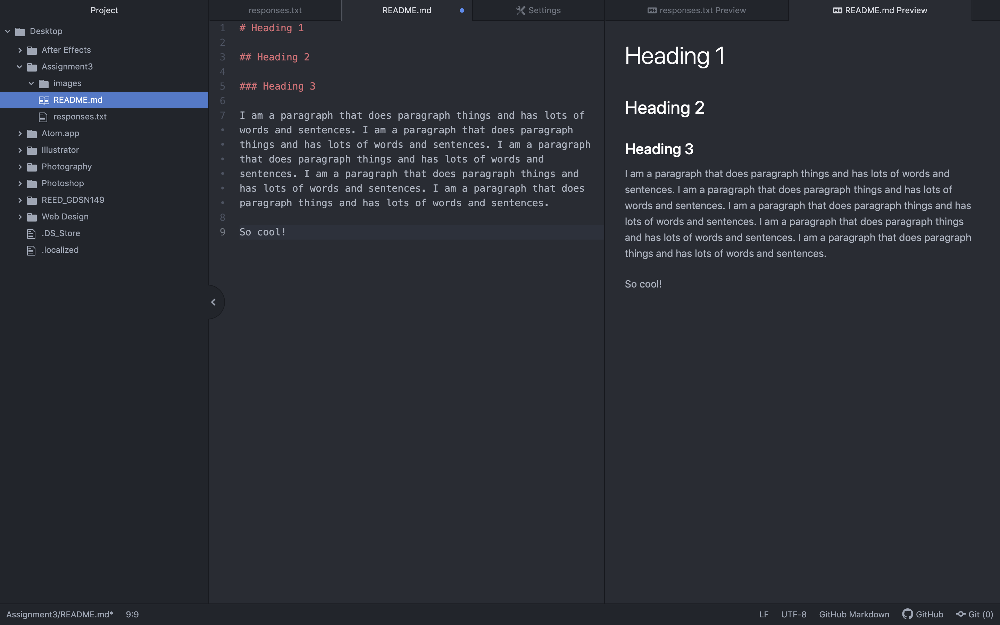

# Heading 1

## Heading 2

### Heading 3

I am a paragraph that does paragraph things and has lots of words and sentences. I am a paragraph that does paragraph things and has lots of words and sentences. I am a paragraph that does paragraph things and has lots of words and sentences. I am a paragraph that does paragraph things and has lots of words and sentences. I am a paragraph that does paragraph things and has lots of words and sentences.

So cool!

[Thrasher Magazine](https://www.thrashermagazine.com)

[My responses](./responses.txt)

# What I Have Learned

1. I have learned the basics of markdown.
2. I have learned different file extensions and what they mean.
3. I have learned how to make this really cool list of things while writing this really long sentence that doesn't run off of the page because I know how to toggle soft wrap and keep the text from escaping my view.
