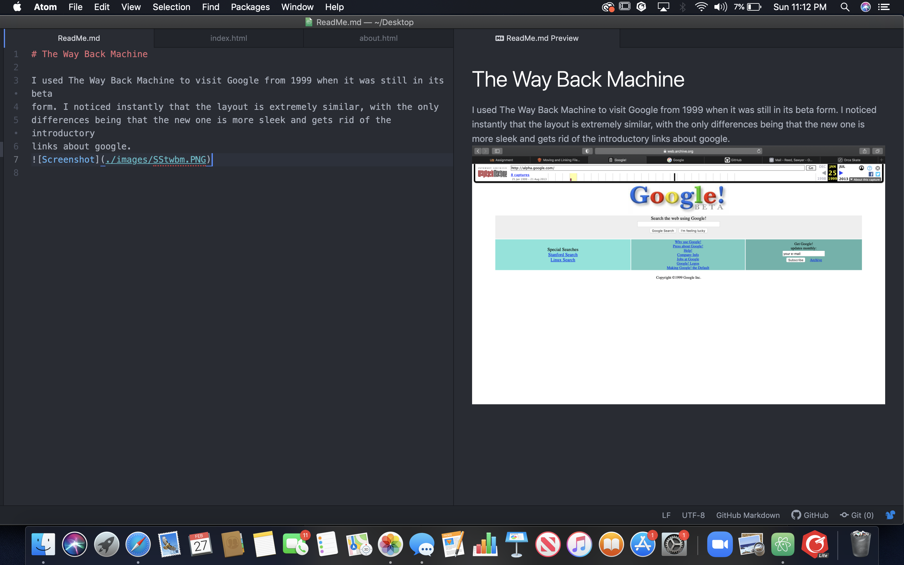

# The Way Back Machine

I used The Way Back Machine to visit Google from 1999 when it was still in its beta
form. I noticed instantly that the layout is extremely similar, with the only
differences being that the new one is more sleek and gets rid of the introductory
links about google.

