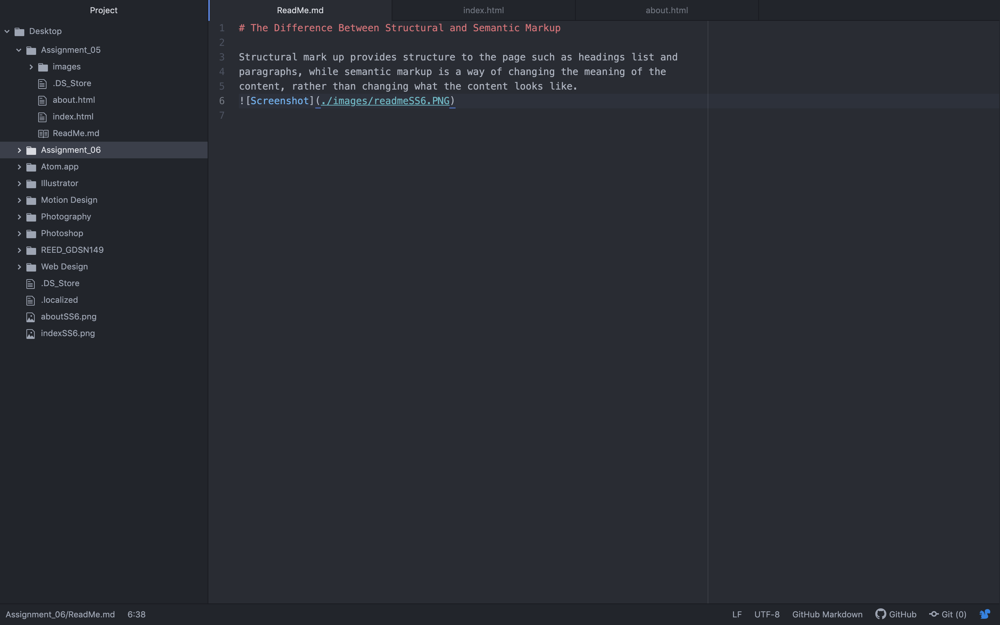

# The Difference Between Structural and Semantic Markup

Structural mark up provides structure to the page such as headings list and
paragraphs, while semantic markup is a way of changing the meaning of the
content, rather than changing what the content looks like.

